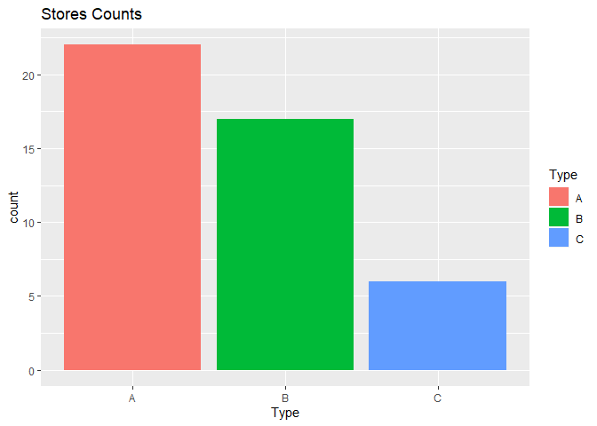
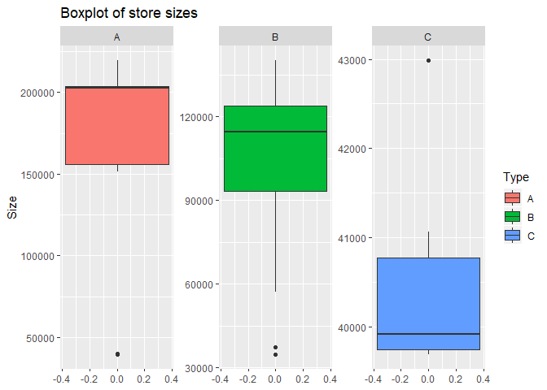
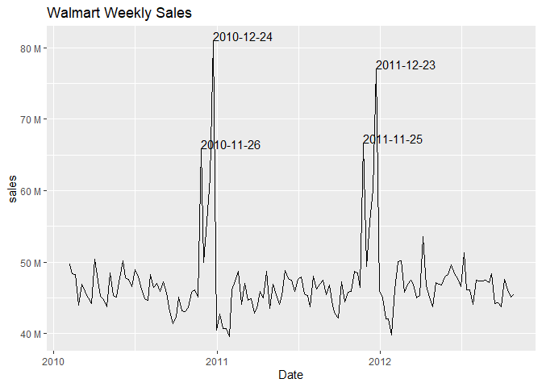
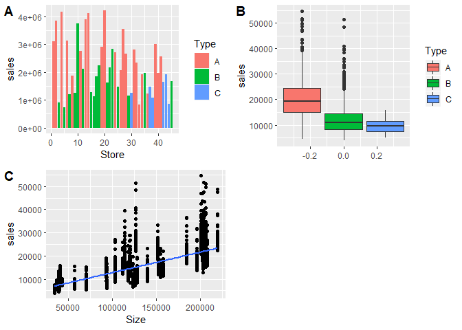

Marsool Project
================

Walmart Data Analytics
======================

##### Walmart is an American multinational retail corporation that operates a chain of hypermarkets, discount department stores, and grocery stores. We've been provided with a dataset containing weekly sales of different Walmart stores, our task is to provide insights and to forecast future sales.

##### I will be using R language, let's go!

### loading the required datasets and preprocessing them

``` r
stores <- read.csv("stores.csv")
sales <- read.csv("train.csv")
features <- read.csv("features.csv")
sales$Date<-as.Date(sales$Date)
features$Date <- as.Date(features$Date)
```

Exploratory Data Analysis
-------------------------

### Exploring the Stores dataset

``` r
str(stores)
```

    ## 'data.frame':    45 obs. of  3 variables:
    ##  $ Store: int  1 2 3 4 5 6 7 8 9 10 ...
    ##  $ Type : Factor w/ 3 levels "A","B","C": 1 1 2 1 2 1 2 1 2 2 ...
    ##  $ Size : int  151315 202307 37392 205863 34875 202505 70713 155078 125833 126512 ...

``` r
summary(stores)
```

    ##      Store    Type        Size       
    ##  Min.   : 1   A:22   Min.   : 34875  
    ##  1st Qu.:12   B:17   1st Qu.: 70713  
    ##  Median :23   C: 6   Median :126512  
    ##  Mean   :23          Mean   :130288  
    ##  3rd Qu.:34          3rd Qu.:202307  
    ##  Max.   :45          Max.   :219622

``` r
summary(stores$Type)
```

    ##  A  B  C 
    ## 22 17  6

``` r
ggplot(stores,aes(x = Type)) + 
  geom_bar(aes(fill=Type),position = "dodge")+
  ggtitle("Stores Counts")
```



``` r
ggplot(stores,aes(y=Size,fill=Type))+
  geom_boxplot()+
  facet_wrap(~Type,scales = "free")+
  ggtitle("Boxplot of store sizes")
```



#### Walmart included 3 types of stores in the Data set, A,B, and C. As we can see From the first chart, the majority of stores are of Type A. All of them differ considerably in size, Type C are the smallest.

Exploring the weekly sales
--------------------------

``` r
all_sales <- sales %>% group_by(Date) %>% summarise(sales = sum(Weekly_Sales)) %>%
  mutate(sales = sales / 10^6) 

ggplot(all_sales, aes(x = Date, y = sales)) +
  geom_line()+
  scale_y_continuous(labels = unit_format(unit = "M"))+
  geom_text(aes(label = ifelse(sales >65, as.character(Date), '')), 
          vjust = 0, hjust = 0)+
  ggtitle("Walmart Weekly Sales")
```



### We can see from the provided chart that the sum of stores sales spikes sharply before Christmas and Thanksgiving!

### Correlation between Size and Weekly Sales

``` r
by_store <- sales %>% group_by(Store,Date) %>% summarise(sales = mean(Weekly_Sales))
by_store <- by_store %>% inner_join(stores, by = c("Store" = "Store"))


plot1 <- ggplot(by_store, aes(x = Store,y=sales,fill=Type)) + 
  geom_col()

plot2 <- ggplot(by_store,aes(y=sales,fill=Type))+
  geom_boxplot()

plot3 <- ggplot(by_store,aes(x=Size,y=sales))+
  geom_point()+
  geom_smooth(method = "lm", se = FALSE)

cowplot::plot_grid(plot1, plot2,plot3, labels = "AUTO")
```



#### There is positive corelation between store size and weekly sales as expected

Effect of CPI, Feul Price, and Temp on the Weekly Sales
-------------------------------------------------------

#### we can use a regression model to see the effect of the mentioned variables on the Weekly Sales and forecast future sales, please contact me to see more of my work!

. . . . . . . . . . . . .

Fayez Alshehri,
---------------

Data Scientist
--------------
